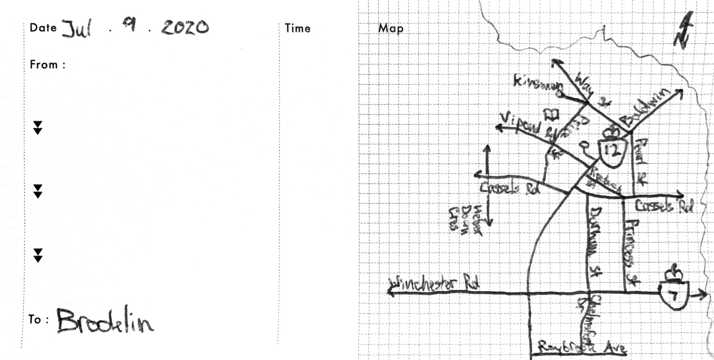
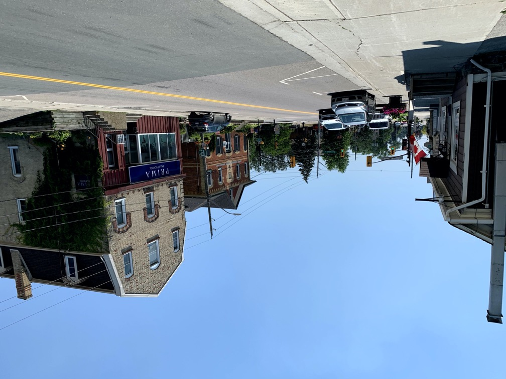
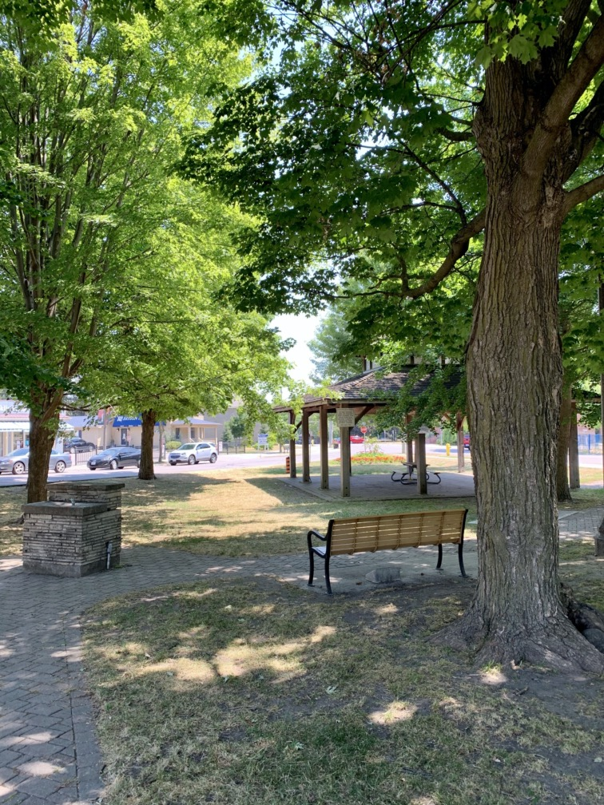
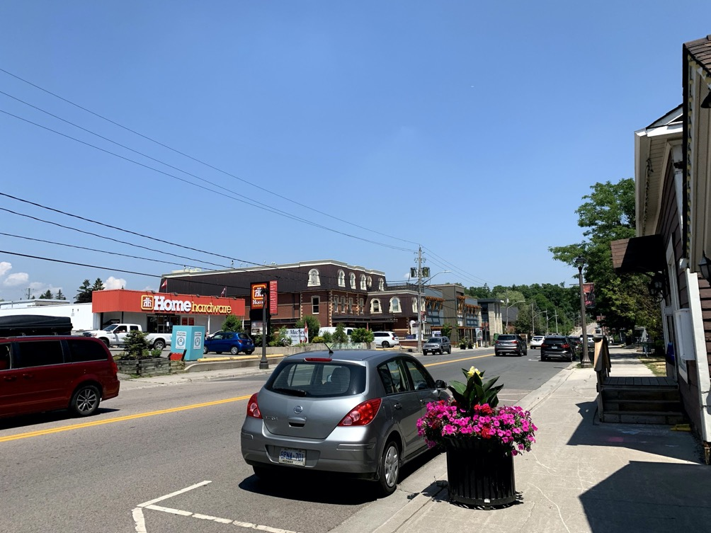

# Brooklin

[Brooklin](https://www.whitby.ca/en/discoverwhitby/downtownbrooklin.asp?_mid_=32491) is a village in the north of Whitby, originally created to serve a mill on a long-defunct railway. As such, there are lots of neat old things to see. 

Brooklin's downtown is centred along [Baldwin St](https://goo.gl/maps/Tr7wrwYRCUmDdf1r6). In the south are many nice restaurants and shops, many of which are descendants of businesses that have been here since the beginning. It seems that every building in Brooklin has a historical plaque on it! 

Moving north, we come across [Grass Park](https://goo.gl/maps/29zSvLKzhQf6v4om9). The park is actually not named for the grass, but actually the Grass family which later (indirectly) sold the land to the town. A fitting name if there ever was one! 

Grass Park is a fitting centre for Brooklin. 

While small, it is cozy and centrally located, making it easy to get to. It has many large trees to provide shade and a sense of ''coolness'', and there are benches and tables to sit at. A good ''town square'' is important for tying a locale together. 

Moving north, we head into a more industrial part of town. Here, we can find Home Hardware, larger commercial buildings (that still blend with the town!) and new construction. This part still has many nice places to go to, it's just not as old. But it's still very nice. 

Downtown Brooklin comes to an end at the [Brooklin bridge](https://www.google.ca/maps/place/43%C2%B057'32.7%22N+78%C2%B057'35.6%22W/@43.9590881,-78.9605207,189m/data=!3m2!1e3!4b1!4m14!1m7!3m6!1s0x89d519214074d5dd:0x91e7a20e0d0b3749!2sBrooklin,+Whitby,+ON!3b1!8m2!3d43.9631607!4d-78.9571069!3m5!1s0x0:0x0!7e2!8m2!3d43.9590865!4d-78.959881) (not [that one](https://en.wikipedia.org/wiki/Brooklyn_Bridge)), with houses beyond. However, venturing to the west, we still have one more place to see. 

Between [Kinsmen Ct and Vipond Rd](https://www.google.ca/maps/place/Brooklin+Kinsmen+Park,+Whitby,+ON+L1M+1B7/@43.9575987,-78.9638887,444m/data=!3m1!1e3!4m13!1m7!3m6!1s0x89d519214074d5dd:0x91e7a20e0d0b3749!2sBrooklin,+Whitby,+ON!3b1!8m2!3d43.9631607!4d-78.9571069!3m4!1s0x89d5191808d4a219:0x5f4b72f48fd02fb0!8m2!3d43.9583163!4d-78.9632926) is the library and Kinsmen Park, which is a little forest next to the creek. Both are very nice. The park provides a place to venture out amongst the trees with no chance of getting lost, and the library (like all Whitby library buildings) is of excellent construction and a great place to be. 

Brooklin has an excellent downtown to offer, with lots of history, shops, and parks to go and see. Definitely a great place to check out!

***
###### Plaques:  
[About the Mill](images/Mill%20History.pdf)  
[About Grass Park](images/Grass%20Park.pdf)
***