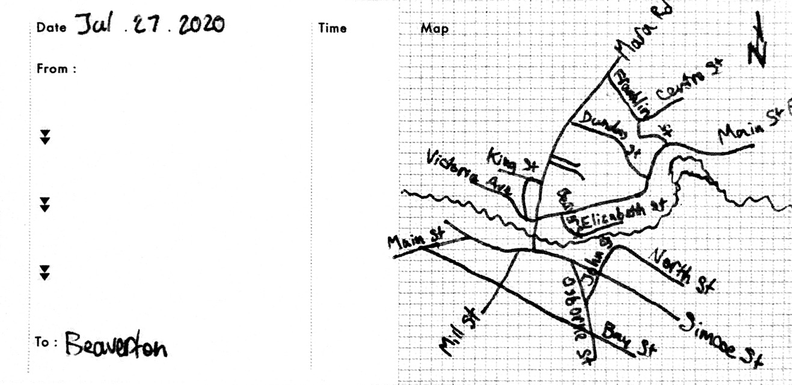
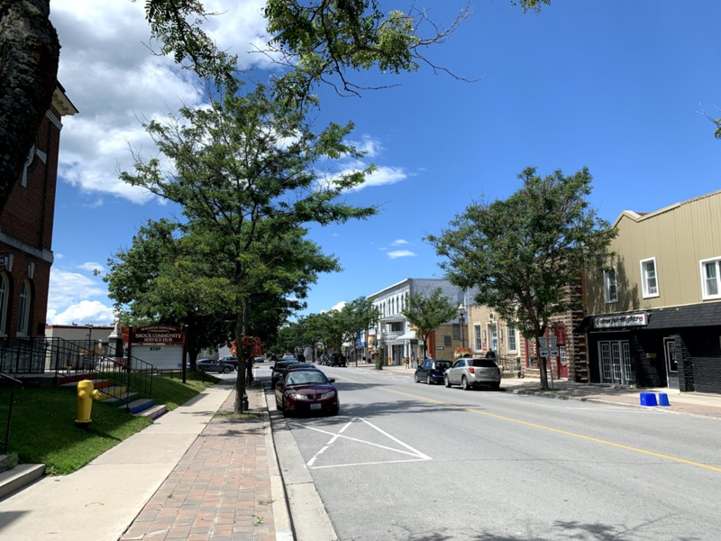
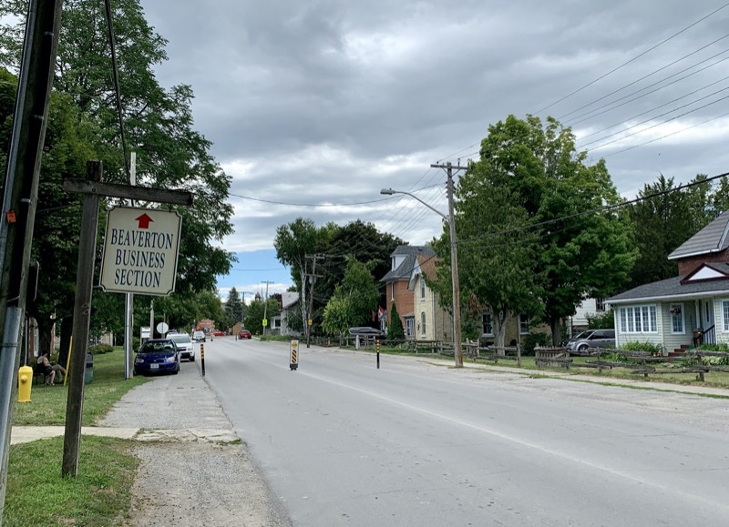
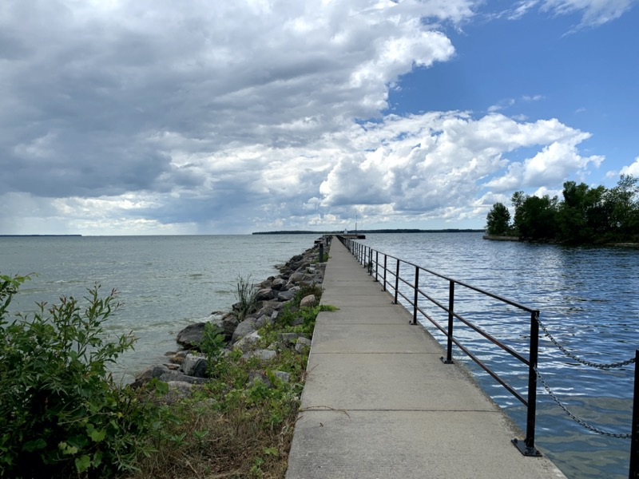

# Beaverton  
  
> The northernmost downtown in Durham.  

<aside>[See more here](https://photos.app.goo.gl/nGcRDu9K5ihVEpMR7). Click ℹ️ (or swipe up ↑ on iOS) for more details, thoughts, and notes.</aside>

Beaverton has a really nice downtown. Along with [Brooklin](brooklin), it is my favourite downtown so far.  

Started in the mid-1800s by a Scotsman who opened a mill so that farmers wouldn't have to lug their grain all the way to Newmarket, Beaverton really flourished when it became the terminal point for the **Port Hope, Lindsay, and Beaverton Railway** which linked Lake Simcoe in Beaverton with Lake Ontario. At one point, Beaverton had three different kinds of mills and was literally called *Mill Town* (because that's what it was), before the name Beaverton was chosen. Since then, the railway has been absorbed and the station gone, but Beaverton is still around.[^F]

[^F]: Fun Fact: [King's Highway 12](http://www.thekingshighway.ca/Highway12.htm) used to pass through Beaverton along Osborne and Simcoe Sts, and Mara Rd (as can be seen in the second map [here](http://www.thekingshighway.ca/MAPS/Hwy12map.htm)), but is now only home to the end of [Lake Ridge Rd](https://goo.gl/maps/tL1jf7U8eD7vaZEA9). Regional Road 23 and King's Highway 48 now encompass part of the old route. 

Beaverton's downtown still feels old, but it's really nice. Even though there is a pandemic on, the downtown was lively and felt lived in,[^1] which is a quality that I'm now noticing other places lack. 

Even though the place feels old, it is still well-maintained, and it was delightful strolling up and down the main street (there's only one and it's ironically *not* actually Main St). They have also done a good job (which [Bowmanville](bowmanville) is trying to do) making the street feel integrated as opposed to a moat separating two halves of downtown. The street is narrow and slow/not busy enough that jaywalking[^2] is a viable and desirable way to cross the street. In fact, I noticed a distinct lack of crosswalks, probably to encourage safer pedestrian activity.[^3] It works. 

They also have ''[safety sticks](https://photos.google.com/share/AF1QipPPLpsmAbNvJ6BMnDZqccIFkH0oHoWzVyKJJyRW8gcGWVwX964NkJDcCN4TPSRZIA/photo/AF1QipNVIUuJFzNQUN_8ErjJItrUDVxGoshGeycwKewT?key=VVl3OFAwMXpJcEtZdjhnekgwWnU5NHZxQ3dKV2tR)'' (I don't know what they're called) on the street around downtown to make drivers slow down and think about where they're actually driving through. They work and make the community feel safer. 

Beaverton downtown has may nice shops to check out, a beautiful park or two, a lovely former town hall, a library, and two pharmacies. The trees and sidewalks provide to a comfortable walking experience, and the locals are friendly. It's definitely a place to visit. 

## The Pier

But that's not all Beaverton has to offer! The *[Park to Pier Discovery Trail](http://btehs.com/park-to-pier-discovery-trail/)* is definitely a thing to check out. This trail basically covers why Beaverton *is*. At a little less than 1km long, its not hard to walk (although it is not really accessible as it involves walking on the road and crossing train tracks) and is well-signed. Along the way you get to see the old mill, tracks, and the harbour front, which is absolutely stunning. I think you can see Barrie and Orillia from the pier. I would definitely check this out if I was in the area. 

***
Beaverton is a really nice place with grand old buildings, a compact yet ''useful'' (for lack of a better word) downtown, and a lovely waterfront. The downtown does an excellent job managing pedestrians and cars, and there are lots of interesting sights to see in the area. Check it out!

[^1]: Masks were still in use when a 2m separation could not be maintained, as currently recommended by Health Canada and Durham Health. 
[^2]: **Safely** of course!
[^3]: Ironically, crosswalks can *decrease* pedestrian safety by making people feel like cars will stop for them regardless, whereas without crosswalks, people and drivers check and make eye-contact more often, thus increasing safety. 

***
<!-- [Getting there by Lake Ridge Rd]() -->
***
[Beaverton Plaques](images/Beaverton%20Plaques.pdf)
> [Home](http://robeandr.github.io) > [MTT](../../MTT.html) > [DTT](../DTT.html)