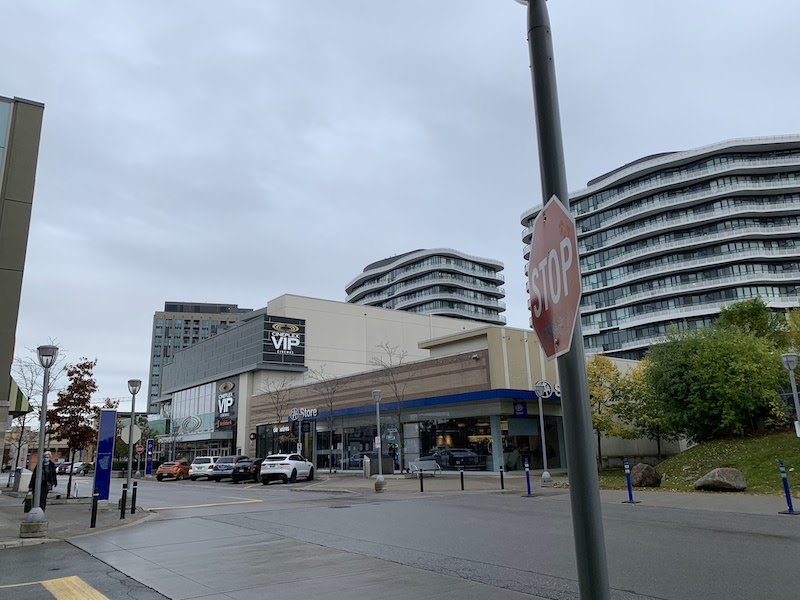
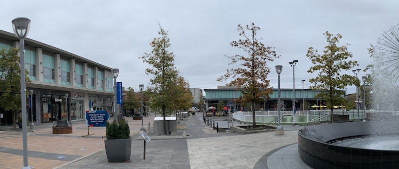

<h2 id="toc_0" class="streetcar">Andrew Robertson</h2>
<table><tbody>
<tr>
    <td><a href="../../index.html">Home</a> <b></b></td>
    <td><a href="../../MTT.html">↓ MTT<b></b></td></a>
    <td><a href="../../portfolio/index.html">Co-Op Portfolio</a> <b></b></td>
    <td><a href="../../resume.html">Résumé</a> <b></b></td>
    <td><a href="../../portfolio/text.html">Links</a> <b></b></td>
    <td><a href="../../download.html">↓ Downloads</a> <b></b></td>
</tr>
<tr>
    <td></td>
    <td><a href="../DTT.html"><b>DTT</a></b></td>
    <td></td>
    <td></td>
    <td></td>
    <td><a href="../../Signs.html">Signage</a></td>
</tr>
</tbody></table>

 

<h1 style="font-family: 'Proxima Nova', 'Approxima Overdrive', Geneva, Helvetica Neue, Helvetica, ui-sans-serif, Tahoma, Verdana, sans-serif; background-color: #016296; color: white; border-color: #313131;">Don Mills Shops</h1>

> *The perfect planned community['s shops]*. 

<iframe width="100%" height="350" frameborder="0" scrolling="no" marginheight="0" marginwidth="0" src="https://www.openstreetmap.org/export/embed.html?bbox=-79.34844925611704%2C43.733522711598255%2C-79.34196367471903%2C43.7370072501065&amp;layer=mapnik" style="border: 1px solid black; max-width: 566px;"></iframe> <small><a href="https://www.openstreetmap.org/#map=18/43.73527/-79.34521">View Larger Map</a></small>
[See in Maps](https://maps.apple.com/?address=1090%20Don%20Mills%20Rd,%20Toronto%20ON,%20M3C%203R6,%20Canada&auid=1824557413474207799&ll=43.734926,-79.344914&lsp=9902&q=CF%20Shops%20at%20Don%20Mills&_ext=CiUKBAgEEGIKBAgFEAMKBQgGEIcCCgQIChABCgQIQBAACgQIQxABEiQpaW4q96fdRUAxoBv1a0bWU8A5hZZ1/1jeRUBBrs0Q2ObVU8A%3D&t=m)
 
<fieldset>

<legend class="Record"><a href="https://photos.app.goo.gl/norAgauW5rvQQDXC7" target="blank">📸 Photo Tour</legend>

 
Because sometimes photos say so much more than words.</a>

Click ℹ️ (or swipe up ↑ on iOS) for more details, thoughts, and notes.

</fieldset>

♿ The area is basically flat with wide sidewalks and accessible parking.

 
[Don Mills](http://spacing.ca/toronto/2009/04/30/shops-at-don-mills-the-newest-grey-space/) was Canada's first master-planned community and it has kept that reputation. 
 
Created in 1953 as a response to Toronto's rapidly-growing cookie-cutter suburbs, Don Mills was intended to be a complete community. There would be housing of all kinds with schools, churches, and community centres within walking distance. All buildings would be approved by a board of architects to keep things looking fresh ''until residents could impose their own sense of community.''[^ref] Industry would be situated at the edges of the community to give residents a place to work (this may have been an American planning influence, where communities were expected to me more self-reliant than in Ontario). There would be a shopping quadrant. Streets would be short and twisty to make drivers slow down. And the entire thing would be tied together with parks and walking trails to keep automobiles and pedestrians separate. 

And... it worked? Don Mills was quite successful, and is still a pleasant place to live to this day. While the street layout and architecture is dated today, it did work in making a community that people are still proud of. The Don Mills influence can be seen in watered-down, cheapened form all over the world: short curving streets, wide houses, and local schools – and sometimes these neighbourhoods even include a shopping centre! However, unlike Don Mills, these suburbs have become a pox on our society: by not including the green space, trails, and community centres, they have encouraged excessive driving and hampered transit. 

Today, communities aren't built like Don Mills anymore: mixed-use residential and denser grids that are more transit-friendly are in vogue, but the idea of having everything a community might need day-to-day within easy reach is still recognized as being absolutely critical in neighbourhood development. 

> #### References
> 1. *[Once Upon a City: How Don Mills changed city building](https://www.thestar.com/yourtoronto/once-upon-a-city-archives/2016/07/21/once-upon-a-city-how-don-mills-changed-city-building.html)* – Toronto Star; July 21, 2016
> 2. *[Toronto's mother of all suburbs: Don Mills](https://www.thestar.com/news/gta/2009/03/21/torontos_mother_of_all_suburbs_don_mills.html)* – Toronto Star; March 21, 2009
> 3. Richard White (2014) Toronto, an American city: Aspects of its post-
war planning, 1940–1960, American Review of Canadian Studies, 44:1, 68-81, DOI: [10.1080/02722011.2014.887129](https://www.tandfonline.com/action/showCitFormats?doi=10.1080/02722011.2014.887129) ^[Link](https://doi.org/10.1080/02722011.2014.887129)

[^ref]: *[Once Upon a City: How Don Mills changed city building](https://www.thestar.com/yourtoronto/once-upon-a-city-archives/2016/07/21/once-upon-a-city-how-don-mills-changed-city-building.html)* – Toronto Star; July 21, 2016
 
### Today[^f]
 
[^f]: OK, well, last week.

Surprisingly, I found the outdoor mall/pseudo-town layout of the Shops at Don Mills to be very enjoyable. It feels better than an indoor mall, which is not what I was expecting — especially in Canada. (Now I didn’t visit in the winter, so that may be a factor, but it was cool and overcast.) 
 
The mall is set up like a town with curving streets, long rows of architecturally interesting short storefronts, and a central park. However, unlike some of the other downtowns we have seen, this one is completely privately-controlled and was built with modern planning in mind. This means that even though there are streets running through the “mall” it doesn’t feel like it. The sidewalks are wide and easy to walk on, and there is on-street angle parking to provide a buffer between the street[^s] and the sidewalk. Also, the streets are winding and short so they’re easy to walk down but hard to drive along. The streets also feel narrow: even though they are indeed wide enough for two cars to pass, it’s close, so drivers feel like they need to slow down. All of this combines to give an atmosphere that, while not as extreme as a [woonerf](https://en.wikipedia.org/wiki/Woonerf?wprov=sfti1), feels like it’s for people. Jaywalking is possible, and low speeds mean it is safe.[^private][^eye] Parking is also concentrated in a parking garage on the edge of “town” so drivers don’t feel like they can just drive on up like in a normal strip mall. In fact, a significant part of the on-street parking is wheelchair, which makes sense. Large, friendly directional signs guide new drivers away from the centre and to the parking garage, and big counters reassure drivers that they will indeed get a spot.[^freaky]
 
What’s on offer is nice, too. It’s mostly high-end “boutiques”, and there are some favourites like Lindt chocolate. There are no electronic stores, though, I suppose because it’s an outdoor mall. 
 
The central square is really nice. When there’s not a pandemic, there’s places to sit, there’s a nice fountain that looks like a dandelion, washrooms, [an art](https://mcmansionhell.com), [^art] and firepits that were lit in the afternoon. 
 
[^art]: Houses on a stick, if you want to know.
 
[^freaky]: It’s actually a little freaky seeing them all count down in real time over the course of a day. 
 
[^eye]: Drivers can make eye-contact with pedestrians and vice-versa. 
 
[^private]: This is private property, too, so it might even be legal.  
 
[^s]: I use “street” in this instance as the common form meaning where the cars are, even though streets are for people. Isn’t it odd that we now have to specify that some streets are car-less?
 
[See more in the photos](https://photos.app.goo.gl/norAgauW5rvQQDXC7) <b style="color: #016296;">|</b> [Don Mills Heritage Plaques](images/Don%20Mills%20Plaques.pdf)

> [Home](http://robeandr.github.io) > [MTT](../../MTT.html) > [DTT](../DTT.html)
