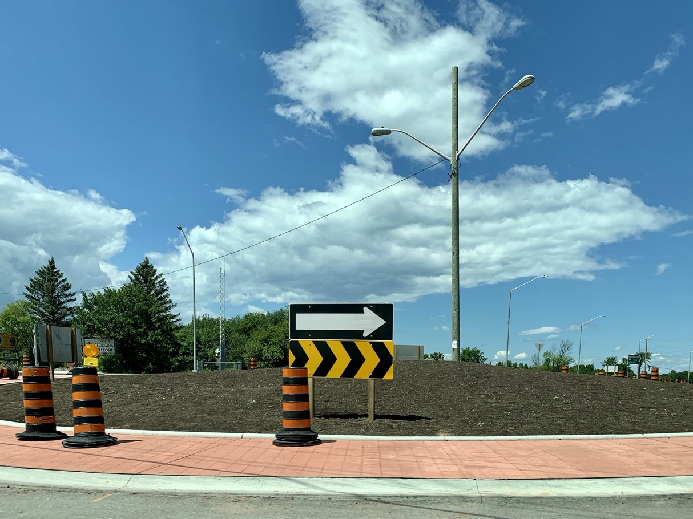

# Fun Facts
## Things to Notice on Ontario Roads
There are lots of little things to see on Ontario roads, and while in and of themselves each one may not be interesting, together I think they warrant enough to make a list. This may be added to over time as I come across new things. 

[TOC]

### Lake Ridge Rd
To structure this list, we can use the [journey to Beaverton along Lake Ridge Rd as an example.](https://www.openstreetmap.org/directions?engine=fossgis_osrm_car&route=43.8339%2C-78.9710%3B44.4322%2C-79.1669#map=14/44.4231/-79.1547)  Lake Ridge Rd,[^p] fittingly, runs from the lake to the [Oak Ridges Moraine](https://www.ontario.ca/page/oak-ridges-moraine#section-0). It then continues northward, transitioning to a [Thorah concession road](https://www.openstreetmap.org/?mlat=44.3570&mlon=-79.1891#map=15/44.3570/-79.1891), before finally finishing as Osborne St in Beaverton. 

Let's take a look. 

[<aside>Follow along in the photos</aside>](https://photos.app.goo.gl/GjrHYCyGF8Gt7cWG9)

#### MTO Intersections
<iframe src="https://www.google.com/maps/embed?pb=!4v1596069055242!6m8!1m7!1s8r5fWu3JvJEKyZWlaTIxCA!2m2!1d43.82849951756663!2d-79.09877652334892!3f337.22932890169557!4f5.706361445367733!5f1.7210466892229808" width="600" height="450" frameborder="0" style="border:0;" allowfullscreen="" aria-hidden="false" tabindex="0"></iframe>  
MTO and non-MTO signal poles at the same intersection on Highway 2 (Kingston Rd). [Example](https://photos.google.com/u/1/share/AF1QipOVEfOOPaD6p6bJX-o-oZNicaJRiVs3XnlvghBE-e1lD1SyiSVcwLwU5lrcGns42w/photo/AF1QipO9k1Ckz3r6e4VvLhShlggQcOUAu0zusauediP3?key=VXpETENYeHhBbU51c0tBTFlHdXRjaXYtMDQ2TGFn)

MTO ([Ministry of Transportation of Ontario](http://www.mto.gov.on.ca)) intersections are easy to spot because they use tapered cylindrical traffic signal poles as opposed to hexagonal ones. You can see a lot of these along [Highway 2](https://goo.gl/maps/YgrEPt3HQ1RYYYQH6) where even though the road belongs to the region, the older intersections will have the cylindrical poles whereas the newer intersections will have the hexagonal ones.[^1] Current King's Highways and 400-series off-ramps will have the MTO poles, too (although off-ramps might not have MTO signal heads). 

#### County Corners

*County corners* are small bits of road that connect pre-existing roads to make an even longer road. They're called ''county corner'' because they typically are not built anymore (they tend to be very tight as they have to squeeze in-between existing property) and thus were created back when the current Region was a county, and they bend: they're corners. 

<iframe src="https://www.google.com/maps/embed?pb=!1m18!1m12!1m3!1d2790.9308985579664!2d-79.15344757719328!3d44.25861695693341!2m3!1f0!2f0!3f0!3m2!1i1024!2i768!4f13.1!3m3!1m2!1s0x89d546803e888f31%3A0x20ce427c3a833e41!2sBrock%2C%20ON!5e1!3m2!1sen!2sca!4v1596070024468!5m2!1sen!2sca" width="600" height="450" frameborder="0" style="border:0;" allowfullscreen="" aria-hidden="false" tabindex="0"></iframe>  
Lake Ridge Rd has a prominent county corner near [Vallentyne](https://www.openstreetmap.org/?mlat=44.2613&mlon=-79.1357#map=15/44.2613/-79.1357) where the road makes a 90º bend after turning left in the settlement to continue north. This corner was built by [Ontario County](https://en.wikipedia.org/wiki/Ontario_County,_Ontario#Ontario_County_(1852-1973)) (the precursor to Durham Region) to make Lake Ridge Rd longer by connecting existing [British township roads](https://en.wikipedia.org/wiki/Concession_road) together. If you're travelling in Southern Ontario and the road makes a sudden bend by 90º and then another one, you've probably just gone around a county corner! 

#### Roundabouts
  
Lake Ridge Rd has Durham's [newest roundabout](https://www.openstreetmap.org/?mlat=44.3188&mlon=-79.1808#map=15/44.3188/-79.1808) (as of this writing[^d]). Roundabouts, if done properly, should feel a little small. This encourages drivers to slow down, as they can feel that they're going too fast. Large vehicles with big tires can drive over the skirt in the centre to get around, while smaller vehicles can't so their speed is still limited. In this way, the roundabout ''adapts'' for vehicle size. 

[Roundabouts](https://goo.gl/maps/dQxLqWcmnTZusZaeA) are circular and all roads approach them head-on so drivers can't just go straight on through. Older designs, called ''rotaries'' were tapered and had smooth exit and entrance roads so that drivers wouldn't feel forced to slow down, leading to more dangerous conditions (even though rotaries *feel* smoother). York University has several [examples](https://goo.gl/maps/VPNhC8Nsm5UmQCh77) of what were then cutting-edge free-flowing[^f] rotaries. (Why they're replacing them with [traffic signals](https://goo.gl/maps/rUF7mdKaJogtSZTa8) and not roundabouts I have no idea!) Traffic circles had vehicles in the circle yield to vehicles entering, so they would actually lock up whenever there was any traffic! 

### Abandoned King's Highways
This is not visible on Lake Ridge Rd, and while this is not really visible from the ground, it is a neat part of Ontario history. Early Ontario highways were often constructed by connecting existing roads, and then when the highway got busy enough, a new, straighter, wider right-of-way was constructed and the old one abandoned. These abandoned rights-of-way are visible on aerial imagery (and to some extent, the ground), and dot the province. 

[^d]: 2020-07-29
[^f]: Free-flowing used to be a magical ideal where drivers would never have to stop to get to their destination. We now recognize that getting drivers to slow or stop and consider their situation is a useful thing and the pursuit of ''free-flow'' cost a lot in other areas. 

[^p]: **Lake Ridge** pronounced as one word: ''LakeRij''
[^1]: This can also be used to see if a pole has been replaced (perhaps because it has been run over): it'll be the only one that's not cylindrical. 