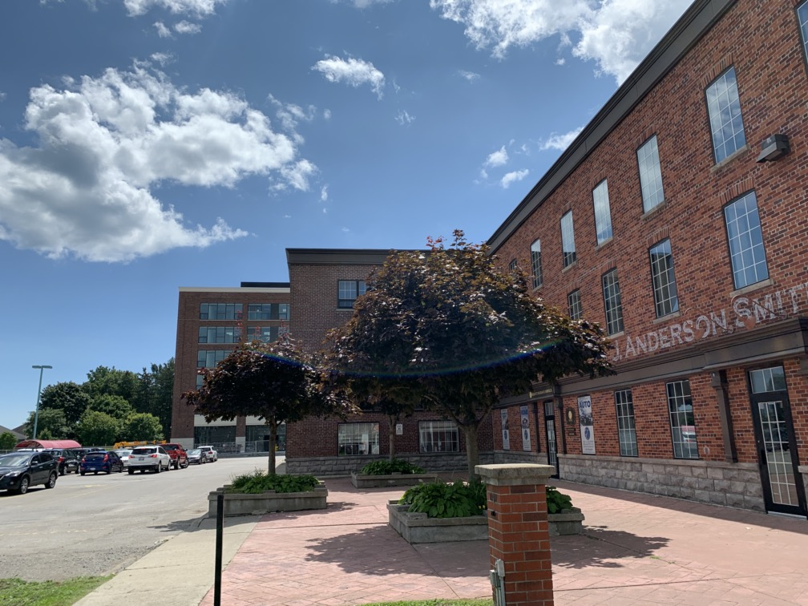

# Newcastle
> A quiet community on the edge of Durham. 
> 
> <fieldset>
> <legend><a href="https://photos.app.goo.gl/56MYWcHMKJrzGKku5" target="blank">Photo Tour</legend>
> Because sometimes photos say so much more than words</a>.  
>
> 
Click ℹ️ (or swipe up ↑ on iOS) for more details, thoughts, and notes.

> </fieldset>

Newcastle is nestled between fields of rolling corn on the eastern edge of Durham, on Hwy 2 beyond the **35/115**. It's a very compact downtown, and pleasant to meander through. 

Newcastle has everything one could want in a downtown. It feels like it could be used as a movie set, if need be. There are delicious-smelling restaurants/pubs of various kinds, clothing and décor shops, places selling knick-knacks, and real-estate. And the beauty of all this is that it is walkable. 

Newcastle is very flat. This is good. It makes it easy to get from one place to another. Newcastle also does this excellent thing where residences are placed next to commercial areas, like apartments next to the [Foodland](https://ontario.foodland.ca/stores/newcastle/). This I like to see! As Newmarket is a retirement community, the walkability of the area is extremely important. 

Besides the shops and the proximity of the residences, Newcastle also holds a lovely little park, library, and community centre. The park is deep and wide enough for a soccer[^f] field and is lined with trees. In this park is also the library, which makes a lot of sense! The library is nothing spectacular, but it looks very nice. 

The community centre is older and grander, and also is situated next to a park that holds the war memorial. This is a community centre to be proud of, Newcastle. 

Newcastle is an excellent community with everything a downtown of this size should have. Everything is near everything else, and there's no end that feels too far-flung from the rest. The entire area is wonderful to browse around, and visiting feels like a breeze. Newcastle is a place to check out. 

[See more in the photos](https://photos.app.goo.gl/56MYWcHMKJrzGKku5) **|** [Newcastle Historic Plaques](images/Newcastle Historical Plaques.pdf)

> [Home](http://robeandr.github.io) > [MTT](../../MTT.html) > [DTT](../DTT.html)

[^f]: i.e. football