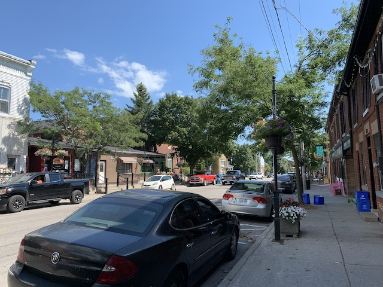

# Orono
> Antiques

> <aside>
> [<b class="Record" style="color: firebrick;">📸 Photos</b>  
> Because sometimes photos say so much more than words.](https://photos.app.goo.gl/isbe9qw99Ys3ZbL47)
> 
>  Click ℹ️ (or swipe up ↑ on iOS) for more details, thoughts, and notes.  
> 
> </aside>

[Orono](https://www.oronofair.com)[^O] is by far the smallest downtown Durham has. It's claim to fame is antiques: Orono is home to *two* antique markets, a general store (that also sells antiques) and an annual agricultural fair! It's a niche, and boy do they fill it! 

Due to Orono's small size, its downtown feels rather... quiet. Wandering amongst its rustic shops and neat sidewalks feels almost like intruding into someone's living room. There's a small assortment of shops, restaurants, and a general store (and LCBO).[^LCBO]

[^LCBO]: I noticed that while Orono is significant enough to warrant a Chinese restaurant, they do not yet have an Indian restaurant (which I believe is next on the diner → restaurant genre chain of downtown evolution).

But there's more to see in Orono than just the downtown. Orono also has an extensive trail next to the creek that's really nice to wander along. There's a pool where you can dip your feet and a park with an outdoor pool at the end (or beginning). 

***

Orono is a place to check out if you're in to antiques, definitely, but otherwise there's not much to see. And that's OK. Orono's thing is that it's small, antique, and has good bakeries. The shops and restaurants look nice, too. 

[^O]: [Despite what it may look like](https://old.reddit.com/r/toronto/comments/czqoeo/small_ontario_town_named_orono_asking_city_to/), [Orono](http://visitorono.com) is pronounced more like [Oreo](https://shop.oreo.com), not [Toron~~t~~o](https://old.reddit.com/r/toronto/comments/1lf9yo/how_does_a_true_torontonian_pronounce_toronto/).

[See more in the photos](https://photos.app.goo.gl/isbe9qw99Ys3ZbL47) <b style="color: #;">|</b> [Orono Plaques](images/Orono%20Plaques.pdf)

> [Home](http://robeandr.github.io) > [MTT](../../MTT.html) > [DTT](../DTT.html)