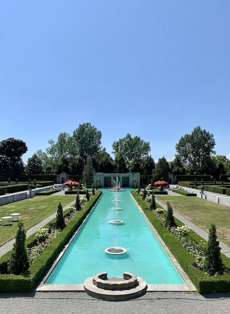

<h2 id="toc_0" class="streetcar">Andrew Robertson</h2>
<table><tbody>
<tr>
    <td><a href="../../index.html">Home</a> <b></b></td>
    <td><a href="../../MTT.html">↓ MTT<b></b></td></a>
    <td><a href="../../portfolio/index.html">Co-Op Portfolio</a> <b></b></td>
    <td><a href="../../resume.html">Résumé</a> <b></b></td>
    <td><a href="../../portfolio/text.html">Links</a> <b></b></td>
    <td><a href="../../download.html">↓ Downloads</a> <b></b></td>
</tr>
<tr>
    <td></td>
    <td><a href="../DTT.html"><b>DTT</a></b></td>
    <td></td>
    <td></td>
    <td></td>
    <td><a href="../../Signs.html">Signage</a></td>
</tr>
</tbody></table>

 
<h1 id="toc_0" style="background-color: #005696;">Oshawa & Parkwood</h1>

<blockquote>

Prepare to be amazed.

</blockquote>

<fieldset>

 ​ <legend class="Record"><a href="" target="blank"><em>Photo Tour</em></legend>

 
Because sometimes photos say so much more than words.</a>
 
Click ℹ️ (or swipe up ↑ on iOS) for more details, thoughts, and notes.

 </fieldset>

<!-- Begin Collage -->

[Oshawa](https://www.oshawa.ca/business-and-investment/discover-downtown.asp?_mid_=690) is the city in Durham (regardless of what [Pickering](pickering.html) has to say). Its downtown is completely unlike any other in Durham Region. It is completely urban. 

Oshawa was founded as a mill town ([surprise](../DTT.html#Durham)!) at the foot of what is now [Simcoe St](https://goo.gl/maps/rBWh5Xj6oUgKj8Ex8). Oshawa has been known for many things in its time, such as [Sir John A](https://en.wikipedia.org/wiki/John_A._Macdonald)'s supposed favourite pub between Toronto and Kingston, but is really known for [GM](https://www.gm.ca). Originally started as the McLaughlin Motor Car C^<u>o</u> by Colonel Samuel McLaughlin, this grew to become the largest car company in Canada. It was later bought by GM and Col. Sam became the president of GM Canada. GM's [Canadian headquarters](https://goo.gl/maps/GUbwj2BYMeMvmuhC9) are still in Oshawa today. 

The [GM plant](https://goo.gl/maps/m3BEsUj46dNzhAjr6) was huge and basically built Oshawa to what it is today. My grandfather and uncle were both once employed by them. However, unfortunately GM has mostly left, and the vast GM lands scattered around Oshawa now lie vacant or occupied by [Costco](https://goo.gl/maps/SGUJTKu6a3QTkoNB9). As such, Oshawa is attempting to reinvent themselves as a university town. Oshawa is currently home to [Ontario Tech University (née UOIT)](https://ontariotechu.ca), a [Durham College](https://durhamcollege.ca) campus, and a [Trent University](https://www.trentu.ca/durham-gta) campus. It's working pretty well, but there's still a way to go. 

## Downtown
Areas around downtown are pretty great. The library, churches around Bagot St, and the gallery are pretty nice. Visit them. There are also nice gardens around City Hall and north of downtown in the former mill pond on Kaiser Cres. 

The rest of downtown is interesting, but is not comfortable to walk around. This does not mean to not visit; there is still a lot to see. Rather, expect to visit *a place*, rather than meander and explore. 

Being the local city, Oshawa has a lot to offer, especially in restaurants. There is classy Indian food, cheaper Indian food, Mexican Indian food, high-end Greek, low-end Greek, ramen, donairs, pizza, Korean barbecue, and more! 

Oshawa also has a bus terminal that has interesting GM murals on the side and an interior that makes Scarborough feel welcoming. The murals are best experienced from a car.[^GM] On a positive note, the Regent Theatre, now part of ONTechU,[^ON] has been lovingly restored and occasionally shows retro movies! Check it out. 

[^GM]: Preferably a GM one. 
[^ON]: Or whatever it's called

# Parkwood
In between running GM (and giving toy cars to my uncles), Col. Sam gave many things to Oshawa.[^Y] As such, many things in Oshawa are named after Col. Sam (or his wife, Adelaide) today as a thanks for his help in building them, including [McLaughlin Library](https://goo.gl/maps/t7GozVngsHs1CfvY8), [The McLaughlin Gallery](http://rmg.on.ca), [Camp Samac](https://goo.gl/maps/Sek5j1rJmY38cARK8),[^1] [McLaughlin Bay](https://www.gm.ca/en/environment/mclaughlin-bay.html), and [Adelaide Ave](https://goo.gl/maps/AbeeAxVxjoDkz7oi7). 

One of the things he left to the public after his death is [Parkwood](https://www.parkwoodestate.com), his estate. 

Parkwood is a glorious mansion with accompanying gardens next to the Oshawa hospital. A short walk from downtown along Kaiser Cres (or through the gardens) and Adelaide Ave, Parkwood is open for the public to enjoy most days until 5. 

Parkwood is worth the visit. There are many gardens to check out, including the Formal Garden which includes a large fountain, trees, and a tea room. Just being there makes you feel classy. It is a classic mansion, and is free to explore. So why not?

***

Oshawa as a city has always been the odd one. While its downtown is certainly unique in Durham and offers many places to go, the downtown itself is not really a desirable destination. However, there are places around the downtown suitable for wandering. The gardens by Kaiser Cres and Parkwood (near the hospital cafeteria) are excellent places to go. That being said, it is certainly worth checking out downtown Oshawa. It is an excellent place to eat and try something new. 

[^1]: Sam~~uel~~ + M[a]c~~Laughlin~~

[^Y]: And other places, too. [McLaughlin College](https://mclaughlin.laps.yorku.ca/about/) at **York** is named after him, which I did not realize. It is also extremely easy to get lost in, and has a nice computer lab in the basement. So there. 

[See more in the photos](https://photos.app.goo.gl/Joo89HrJKnLBFn3s6) <b style="color: #005696;">|</b> [Oshawa Historic Plaques](images/Oshawa%20Historical%20Plaques.pdf)

> [Home](http://robeandr.github.io) > [MTT](../../MTT.html) > [DTT](../DTT.html)

