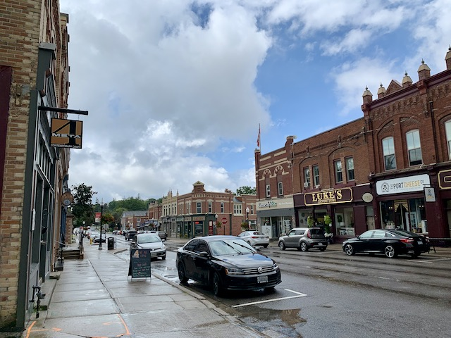
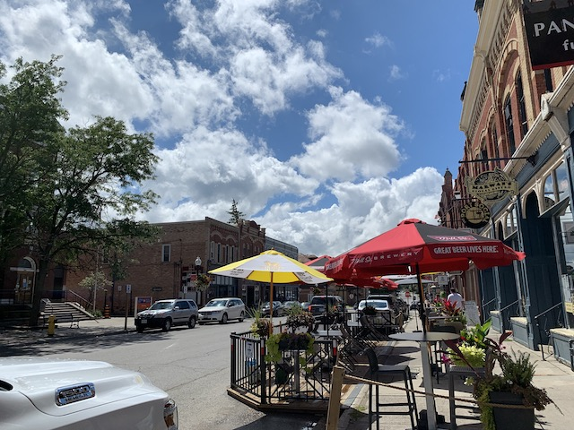
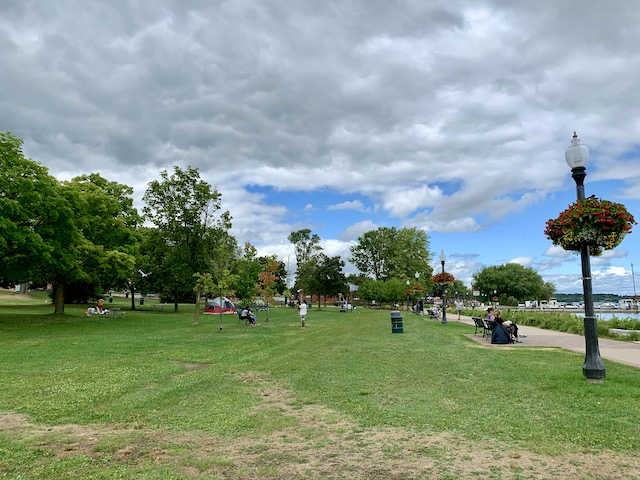

# Port Perry
> An absolutely gorgeous downtown.  

> <aside>
> [<b class="Record" style="color: firebrick;">Photos Here</b>  
> Because sometimes photos say so much more than words.]()
> 
>  Click ℹ️ (or swipe up ↑ on iOS) for more details, thoughts, and notes.  
> 
> </aside>

Port Perry is an absolutely pristine downtown, and somewhere my family went often growing up. 

|  |  |
|---|---|
| Me pointing out Hank’s to my brother and Uncle Andrew. We would go here often as a family, so I wanted to show my visiting uncle from Scotland where we ate. 2005| Looking west at Hank’s in approximately the same location as the Uncle Andrew photo. The pharmacy, café on the corner, and Luke’s are still there, although the pharmacy and café have changed names. 2020 |

Established in 1840 after Peter Perry built a port (go figure) Port Perry is unusual in our downtowns as it's actually *lumber* mills and grain *storage* that got the town started. Port Perry became an important town as the end of the **Port Perry & Port Whitby Railway** ended here and cargo was transferred to steamboats on artificial Lake Scugog to continue north beyond the rails. 

Today's Port Perry downtown was created after the tragic 1884 fire in which the entire downtown[\*](#asterisk) burned to the ground. Fortunately, the downtown was rebuilt within four months, in brick this time. \*Port Perry's grain elevator survived, which also makes Port Perry home to the [oldest grain elevator in Canada](https://scugogheritage.com/history/grainelevator.htm)! 

## Downtown
Port Perry is an absolutely gorgeous downtown. There is so much to see, and the entire area is kept very pristine. It's nice. 

  
Starting in the west, Port Perry has a magnificent former town hall recognized by the Canadian Government for being an excellent example of a town hall for this era. And they're right; Port Perry was obviously a very proud town. 

This continues to this day with such wonderful examples as the [Scugog War Memorial Library](http://www.scugoglibrary.ca/about/library-history-photos/) and accompanying park, which was put together with a collaboration of the local schools. 

  
Moving east, there is much to see on Queen St. Each building has a story attached to it, and while at first they may all look the same, each building was constructed in a specific style by their original owner in order to make a statement. Some of the businesses on this street have been here since the fire. 

And speaking of those businesses, they are all so very interesting! There are options such as a book store, pharmacy, cheese shop, clothing of different kinds, shoes, décor, bikes, local bistro and next door an international bistro, ice cream and chocolate, and a Scottish store! And all of them are well-kept in their buildings with original façade. It's so neat!

## Putting the Port in Port Perry
<aside>  
*There was a train station here. This was the end of the Port Perry & Port Whitby Railway. It apparently was very unreliable.  
I like the family taking their photo. Everyone is very happy.* </aside>

Of course, *Port* Perry has a great waterfront. Like the rest of the town, it is immaculate, historic, and (judging by all the people there[^sp]) popular. This is a place that my Granda and I would come to look at the lake and avoid stepping in all the geese poop. There were less geese this time. It is still just as nice. Regardless of the fact that Lake Scugog is basically a fat river, it is still gorgeous. There was someone canoeing on it and it just looked so restful. No wonder so many people come down here. (And when they're done, there's a great downtown literally just up the street!)

## Traffic
One of the things that I think helps make Port Perry great is, like [Pickering Village](pickering-village.html), their main streets go around the downtown, but near it. Based on what I've seen, this is important. Compare, say, [Bowmanville](bowmanville.html) with Port Perry. On the face of it, both seem very similar with buildings of the same era, a two-lane main street with on-street parking, and downtown cores of a similar length. Yet Port Perry's downtown feels nicer to be in.[^so] So what's the difference? In Port Perry, Simcoe St and Hwy 7A skirt the edges of downtown. In Bowmanville, Highway 2 goes right through the middle. This makes Bowmanville feel like a compromise, but Port Perry feel like a place that people are. [Pickering Village](pickering-village.html) is an excellent example of this, with its slice just off of Highway 2, it's busy enough that it doesn't feel dead, but without the highway running through it, it can feel like a place to visit. 

## So...
Port Perry is a perfect example of a Durham Downtown. It is the place to visit. I wholeheartedly recommend it and I look forward to returning (hopefully to get more cheese)! 

[^sp]: Spaced properly, of course: 2m btwn families!
[^so]: I am sorry, Bowmanville! Feel free to disagree with me; this is opinion, after all.

[See more in the photos]() <b style="color: #;">|</b> [Port Perry Historic Plaques](images/Port%20Perry%20Historic%20Plaques.pdf)

> [Home](http://robeandr.github.io) > [MTT](../../MTT.html) > [DTT](../DTT.html)
