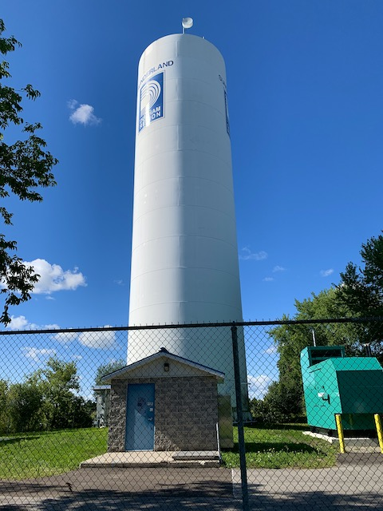

Sunderland
==========

> Short and to the point. 

> <aside>
> [<b class="Record" style="color: firebrick;">📸 Photos</b>  Because sometimes photos say so much more than
words.](https://photos.app.goo.gl/ubAVxEngcLthFNtU7)
>
>  Click ℹ️ (or swipe up ↑ on iOS) for more details, thoughts, and notes.
>
> </aside>

Sunderland is a small downtown that gets to the point and has some magnificent buildings in it. 

## A Brief History[^1][^2]
Sunderland (as the settlement we know and love today) dates from the 1840s when the Jones bothers, who owned most of the land south of River St, built a hotel and divided up their property into lots to spur settlement. The hotel, the cornerstone of Sunderland, was called the *Brock House* and was situated at the corner of Main (now Albert) and River Sts so that everyone coming in to town would see the hotel first thing. 

Over time, these streets would become part of [King's Highway 12](https://www.thekingshighway.ca/Highway12.htm), the [**Toronto-Nipissing Railroad**](cannington.html) would come and go, and Highways 12 & 7 would be rerouted to the east next to what was once the railbed. This leaves Sunderland where it is today, a quiet village next to Highway 12/7 that is the closest spot on the Trans-Canada to Toronto. 

> ### References
> 1. [Brock House Hotel has a storied history](https://www.durhamregion.com/news-story/3515342-brock-house-hotel-has-a-storied-history/)
> 2. [Atherly, Sunderland, Greenbank, Utica, Manchester](http://www.historicmapworks.com/Map/CA/640/Atherly++Sunderland++Greenbank++Utica++Manchester/Ontario+County+1877/Ontario/) –  Ontario County Atlas 1877
> 3. [Brock Township](http://www.historicmapworks.com/Map/CA/641/Brock+Township++Brougham++Washago++Port+Union++Fairport++Cannington++Vroomanton++Sunderland/Ontario+County+1877/Ontario/) – Ontario County Atlas 1877

## Downtown
On the northwest side of town is the town hall and United church. Both are very fine buildings dating from the early 1900s with excellent brickwork and exquisite stained-glass windows. 

Beyond this, the rest of the downtown is fairly small. There's a small grocery store, blacksmith's shop/historical society, and pharmacy. The Brock House is still there, although its façade is white and not very impressive at street level. The red-brick with yellow accents Home Hardware next door is much more impressive. 

<aside>
  
Brock House summer 2020. The Home Hardware is the building with the spires in the background. 
</aside>

And that's about it. There are some other small shops and cafés in impressively-designed old brick buildings, too, but Sunderland is even smaller than [Cannington](cannington.html) (as can be seen as far back as the 1877 Ontario County Atlas). 

## And More
Despite that, like [Pickering Village](pickering-village.html), Sunderland is in that magical position of being close to, but not on the main road (unlike [Cannington](cannington.html)). This leaves the downtown easily accessible and lively, but not busy, which makes it pleasant to wander through. (Although there's not much to wander through.)

Besides the downtown, Sunderland also has a nice park (although not as big as Cannington's). It contains a good walking/cycling path, and you can get right up to the base of the water tower, which is pretty neat. 

<aside style="text-align: center;">
  
Sunderland's ''waterfront'' takes a more vertical approach than most.
</aside>

And that's Sunderland! Not much to see, but some very impressive hidden gems and a surprisingly deep history.[^p]

  
[See more in the photos](https://photos.app.goo.gl/ubAVxEngcLthFNtU7)
> [Home](http://robeandr.github.io) \> [MTT](../../MTT.html) \>
[DTT](../DTT.html)

[^p]: Although no historical plaques I could find. 

[^1]: It is important to note that I am not a historian in any way: I am an engineering graduate and public transit aficionado. Despite this, I have attempted to pull from more-credible sources, but this is still mainly opinion. 

[^2]: Unfortunately, I was unable to find any pre-European settlers' history. While the Jones brothers apparently owned the land, Aboriginals have been living here for thousands of years and have a claim to the land, despite what the Crown may argue. However, any history from that era is hard to find as it may only exist in physical archives which are currently closed or was not recorded at all, as early settlers weren't eager to record how ticked off the original people living there may have been and (as I understand it), Aboriginal history was recorded in non-physical media. 
