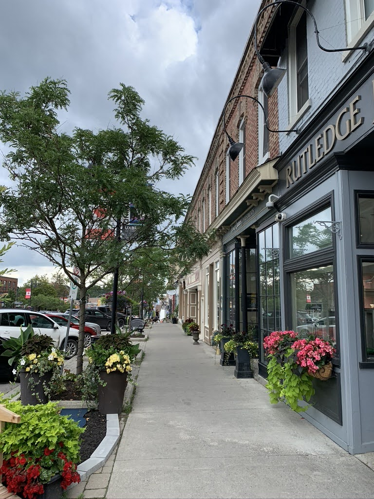
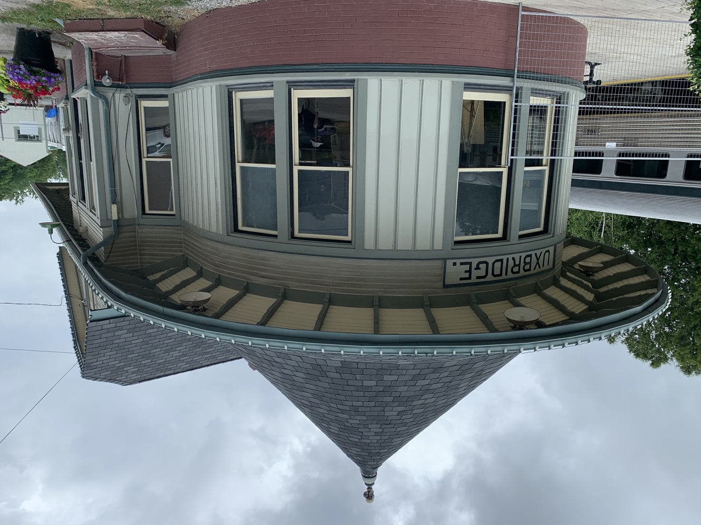
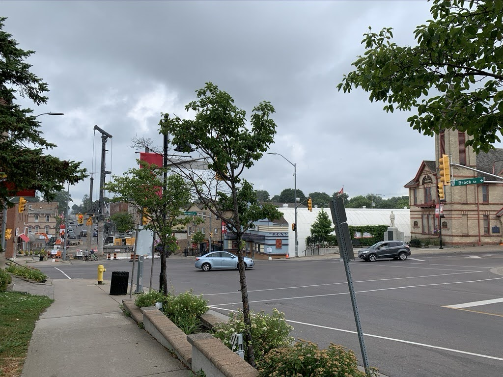
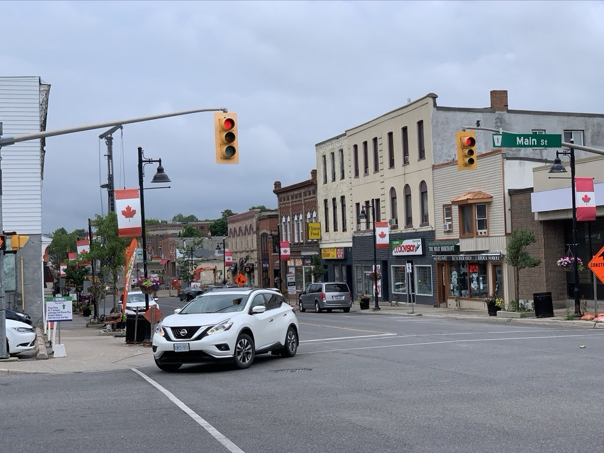
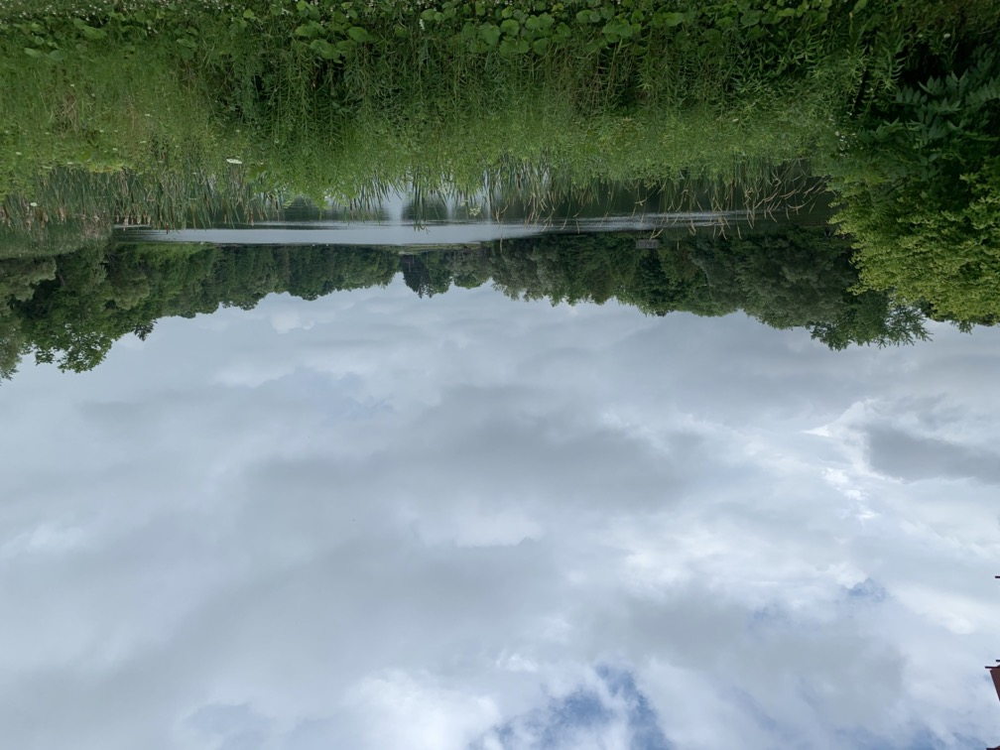
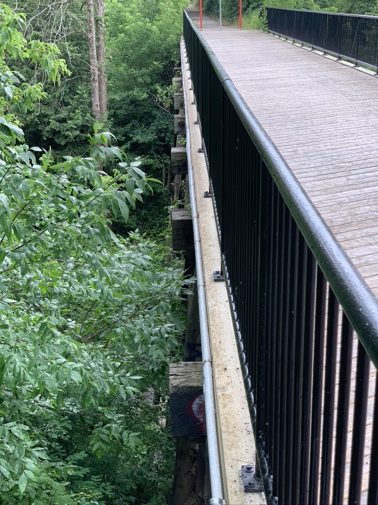
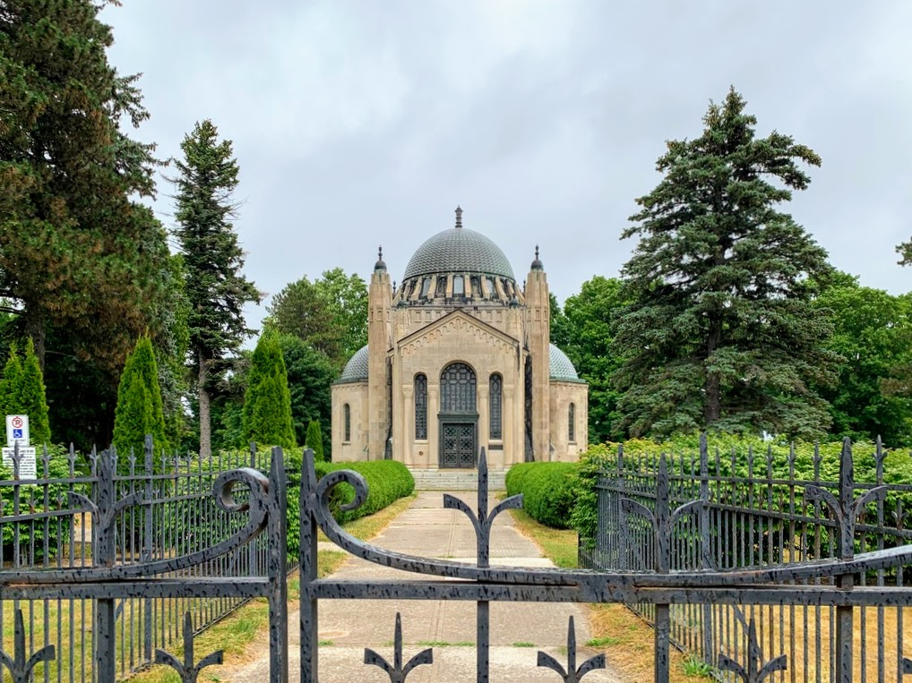

# [Uxbridge](http://discoveruxbridge.ca)
> *''The trail capital of Canada''*

Follow along there↑ and [here](https://photos.app.goo.gl/bSsB9GE29KAcc6KeA). 

## Downtown
At the time of this writing (July 2020), Uxbridge was undertaking its largest-ever infrastructure project: [they are reburying their creek under downtown](https://uxbridgeculvert.ca). This is pretty cool, but it does make downtown a little hard to get around! Never mind that, though; what's in Uxbridge?

Downtown Uxbridge reminds me of Port Perry or [Brooklin](Brooklin.html), although all of these places feel different. Downtown Uxbridge consists of a main ''Four Corners'' with shops spreading out from here. Given that this is the centre of town, and Uxbridge is surprisingly large, these streets are quiet and relaxing enough to stroll down. This could be due to the construction, or the fact that it was a weekend, but it is nice. 

Uxbridge is an old mill town (like [Brooklin](Brooklin.html)), and as such, has lots of historical buildings in its downtown. This includes many old churches, which are wonderful to look at, and the library is amazing, too. The murals on the sides of many buildings make the whole town ''artistic''. 

However, unlike Brooklin, there's still a railway! Due to the numerous mills, Uxbridge was a stop on the **[Toronto and Nipissing Railway](https://en.wikipedia.org/wiki/Toronto_and_Nipissing_Railway)** (TNR) which is now the <b style="color:#794400;">Stouffville GO</b> Line and the [**York–Durham Heritage Railway**](https://ydhr.ca/our-trains-2/) (YDHR). In a neat way, this is still a GO Bus station, with service down to where the GO trains run on the old TNR today.  
But there are trains! And the old train station is still there and looking good. Sadly, GO does not still use this (but the YDHR does, so that's OK). It looks like the [Whitby Station Gallery](https://www.stationgallery.ca/about/), but that's because it was built in the standard [Grand Trunk style](https://en.wikipedia.org/wiki/Grand_Trunk_railway_stations) (like how many Tim Hortons look alike today, for example[^f]) with a big roof for shelter and large sets of windows. However, Uxbridge has a fancier conical roof section that many places don't have. 

[^f]: Or like [Pizza Hut](http://usedtobeapizzahut.blogspot.com)

###### Uxbridge Downtown

## Trails
To see what the [Trail Capital of Canada](images/trail-capital-of-canada.pdf) has to offer, let's look at the [Historic Trail](http://discoveruxbridge.ca/trails/historic-trail/). It provides a nice walk around Uxbridge, and along the way you can see why Uxbridge is. 

The trail goes by Uxbridge's three mill ponds, through Centennial Park, Elgin Park, and a few neighbourhoods of differing ages. The ponds are nice, and Elgin park is large and old and full of trees. It's great. 

[Some Plaques from the Uxbridge Historical Trail](images/Uxbridge%20Historic%20Trail.pdf)

### Trestle
North of Uxbridge, at the end of the York–Durham Heritage Railway is the Uxbridge Trestle. This trestle dates from 1872 and is still around! Now you can walk on it. I like the way this is a bridge that is basically supported on trees, and is from 1872. It's trees holding up the ground instead of the other way around. 

[About The Uxbridge Trestle](images/The%20Uxbridge%20Trestle.pdf)

## [Thomas Foster Memorial](http://www.fostermemorial.com)
<aside>A tiny Taj Mahal</aside>

Finally, north of this, is the [Thomas Foster Memorial](https://goo.gl/maps/KzJab8T2MUp9dwx5A). It's based on the Taj Mahal, was built by a rich guy to honour his family[^t] (much like the original, actually). It's neat to look at. 

[^t]: Which, it seems, isn't actually a bad idea. 

***
[About Uxbridge](images/The%20Founding%20of%20Uxbridge.pdf)  

> [Home](http://robeandr.github.io) > [MTT](../../MTT.html) > [DTT](../DTT.html)