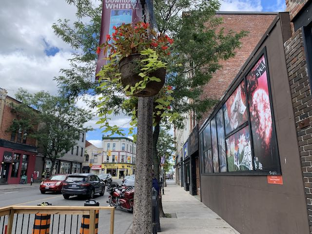
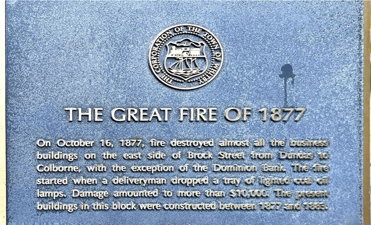
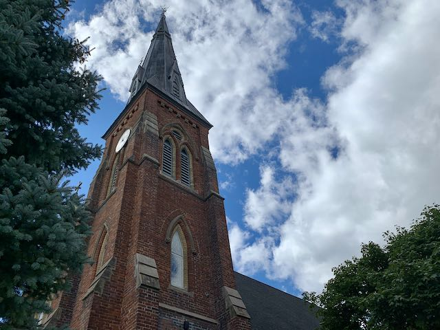
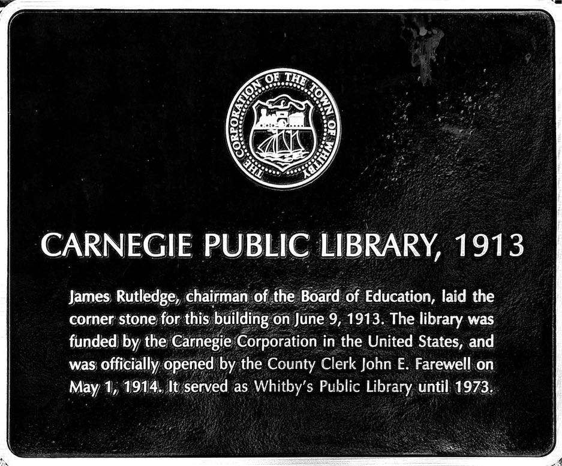

<!-- #013F72 -->
# Whitby

> The heart of the Region. 

> <aside>
> [<b class="Record" style="color: firebrick;">📸 Photos</b>  Because sometimes photos say so much more than
words.](https://photos.app.goo.gl/r7WekocY6gvT6Cx1A)
>
>  Click ℹ️ (or swipe up ↑ on iOS) for more details, thoughts, and notes.
>
> </aside>

[TOC]

## History[^1]

[^1]: This is based on [historical plaques](images/Whitby%20Historical%20Plaques.pdf) around the area. I'll try to update it with information from a Whitby history book I have and anything else I can find.[^2]

[Whitby](https://www.whitby.ca) is the oldest downtown we've come across, with European[^a] settlement predating 1836 at Anderson and Dundas [(surprisingly)](images/whitby-OpenStreetMap.pdf). However, in this year, Peter Perry (yes, [that one](port-perry.html)) built a general store at today's [Four Corners](https://goo.gl/maps/yihy79J3MYfMUa839), establishing Perry's Corners in the area north of Dundas between [~Kent and Hickory Sts](https://earth.google.com/web/@43.8814984,-78.94408558,102.36228677a,1058.95067545d,35y,0.00000001h,42.98514708t,0r). 

This town, the counterpart to [Port Perry](port-perry.html) at the south end of the **Whitby & Port Perry Railway**,[^ff] eventually grew into... Windsor! — which led to obvious problems. So, in 1847 the name was changed to Whitby, and the town grew. 

This was not without incident, however:

## Funky Historic Plaques
Whitby has the most entertaining plaques I've come across. Apparently the town has had a very interesting history.

### 1. 
  
Dropping a tray of fire and burning down half the town must suck, eh? Note how this side of the street also had a fire recently where the mural is. 
### 2. 
  
Although at least that time the fire wasn't shooting back. The collapse a year later really rubs it in. 
### 3. 
  
I have seen this steam fire engine in the library. It certainly looks like it could do this. Unfortunately it wasn't there and the ''upgrade'' didn't pull through (97 years in the future).   
*And finally...*   
### 4. 
  
I have been in the library that replaced this one (and was replaced with the current one): we went in kindergarten[^SK] to get library cards! (I kept mine, but they replaced it when the current building was built. That one's pretty old now, though.)

[^SK]: We had a bunch of neat field trips in Senior Kindergarten, like that time we one to the Pizza Nova to learn about food groups.

[^2]: Whitby seems to have the best-preserved and most-accessible history out of all the downtowns I've looked at, but I could be biased since I'm more familiar with the [Whitby Public Library](https://www.whitbylibrary.ca)[^3] (although the archives aren't open right now, anyway).

[^ff]: Fun fact, the effect of this railway can still be seen in south Whitby today. Compare [this 1877 map](http://www.historicmapworks.com/Map/CA/656/Whitby/Ontario+County+1877/Ontario/) with the empty lots leading north from [Peel Park](https://goo.gl/maps/vRZmKSZCTjyP9b6h9), and the eastern curve of Peel Park, which follows the railway.

[^3]: Still the greatest library building in the GTA in my opinion

[^a]: Inadequate apologies to the Aboriginal people

## Downtown
Downtown Whitby is centred on the Four Corners: Dundas & Brock Sts. Now, both of these streets are  quite busy (with Dundas being Hwy. 2 and Brock 12), which as we’ve [seen in the past](bowmanville.html) is not necessarily good for the experience. However, Whitby appears to have mitigated this, somewhat. Firstly, the downtown is mainly on Brock St, which is narrower (Dundas is not fun). Secondly, Brock St is lined with parked cars, trees, and seating, which provide a buffer between the traffic and slyly encourages vehicles to slow down. 

  
*Can you see the traffic-calming measures here?*

Downtown Whitby is surprisingly diverse, but drops off rather quickly. Whitby has managed somewhat to mask how busy its main streets are and make them pleasant to walk on (Brock more so than Dundas). 

In the downtown core, there's lots to choose from! It's wonderful! I know [Oshawa](oshawa.html) is the place to go for a variety of restaurants, but Whitby has excellent choices, too (and the atmosphere is better). There are Middle-Eastern choices, Indian choices, Canadian choices, French choices, and cafés – all housed in historic buildings from the early days of the town. It's great!

Besides that, there are the historical houses that ring the downtown on quiet, tree-lined streets that are just plain fun to look at.[^lh]

## Conclusion
While downtown Whitby certainly has its faults like the surprisingly high number of parking lots punctuating the area and the busyness of Highway 2 & Brock St, it's still a downtown of heart! There are so many interesting shops and restaurants to visit and the historical plaques are the most ridiculous ones I've seen. Downtown Whitby is a place where I could see taking someone to spend an evening or an afternoon. 

[^lh]: If you think local history is fun, that is.

[See more in the photos](https://photos.app.goo.gl/r7WekocY6gvT6Cx1A) <b style="color: #013F72;">|</b> [Historical Plaques](images/Whitby%20Historical%20Plaques.pdf)
> [Home](http://robeandr.github.io) \> [MTT](../../MTT.html) \>
[DTT](../DTT.html)
