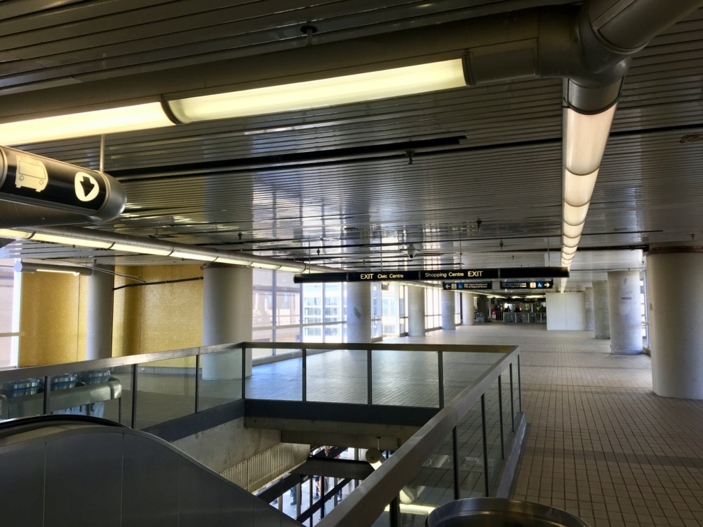

<head>
	<link rel="stylesheet" href="../Style.css">
	<title>Andrew Robertson – MTT: Line 3</title>
</head>
## Andrew Robertson

<table>
<tr>
	<td><a href="../index.html">Home</a> <b></b></td>
	<td><a href="../MTT.html"><b>MTT</b></a> <b></b></td>
	<td><a href="../portfolio/index.html">Co-Op Portfolio</a> <b></b></td>
	<td><a href="../resume.html">Résumé</a> <b></b></td>
	<td><a href="../portfolio/text.html">Links</a> <b></b></td>
	<td><a href="../download.html">Downloads</a> <b></b></td>
	<td><a href="../demo/index.html">Demo</a> <b></b></td>
	
</tr>
</table>
 

# Line 3 SRT

### Yesterday’s tomorrow today. 

I know that Line 3 is controversial and widely detested, and that it probably should have been built as an LRT and [extended to Malvern](https://transittoronto.ca/subway/5107.shtml) (as was originally [intended](https://stevemunro.ca/2010/06/16/multiple-unit-clrv-and-alrv-operation/) and [proposed](https://transittoronto.ca/streetcar/4503.shtml) [many](https://www.stationfixation.com/2014/12/scarborough-centre.html), [many](https://en.wikipedia.org/wiki/Line_3_Scarborough#Replacement_with_alternate_transit) times), but this is just what I thought of it when I rode on it.

## Trains & Ride
First, it's cute! The trains sound like a full-sized GO Train, and then this little thing that looks only a little taller than me trundles into the station. It's very interesting. I don't quite have to duck to get in, but it feels like I should. 

The trains themselves are comfy if not spacious. I think the rehabilitation really helped, although I can't comment on that (I have only ridden in renovated cars). The bright blue wrap with the station names across the top is neat and easily identifiable. I wish the subway stations would do something like this in the strap-line. 

The cars are surprisingly quiet, with a few notable exceptions: switches, corners, and acceleration. The trains absolutely *hate* going over switches. It is so rough, and it makes them sound twice the size that they are. You can feel every little bit of rail. Also, the trains howl occasionally when accelerating. Not all the time, just sometimes. It's very odd and super creepy. 

Other than that, it's actually really quiet, and sounds really nice compared to the Line 2 subway just below. Perhaps it's because it isn't underground. 

The ride isn't rough, but I wouldn't call it smooth, either. The trains don't wobble like normal trains, but they have this weird torque where the entire car kind of twists – like each end of the car sways but at different rates. It's very un-train-like and disconcerting. 

They also accelerate really strangely, too. The entire train glides out of the station, and then once the last car is clear it's like the computer goes, ''`I should now be at 60km/h` [or whatever the speed is]'' and then just floors it until that speed is reached. It's never rough, but it's very sudden. Deceleration doesn't seem to have this problem. 

## Stations

The stations are neat. Like the [TYSSE](Line1University.html), all the stations have a similar theme, although these stations do not have unique embellishments like those newer stations. In this case, that feels like a garage. Or a greenhouse. That a train happens to run through. Again, like most of this line, that's not necessarily *bad*, it's just *odd*. 

I do like the tubular theme they have going, though, especially with all their signs. Again, cute!

###### Totally tubular signs in Scarborough Centre:

## The End
And that's basically it for Line 3. It's pretty short, ends before it should in a field instead of the nearby commuter lot, feels like a really big Meccano set, and connects to the Scarborough Centre GO Bus Terminal which should be avoided if at all possible.[^1] It's odd, but that's not bad.  *Yesterday's tomorrow today.*

***
> _© 2020 Andrew Robertson — Not liable for external links. Made in Ontario, Canada._

[Go Home](http://robeandr.github.io) | [MTTs](http://robeandr.github.io/MTT)

[^1]: As of now (May 2020), I have only two stations on my ''**Avoid if At All Possible**'' List: **(1)** Scarborough Centre (although the [intermediate level](https://photos.google.com/u/1/share/AF1QipN8cl-xQ-eibIZBmW7RAUHKpfzx4yVWkxuTxakOMby9_BSBqM0MrgvBTCEvZy_IRw/photo/AF1QipPrwOsyvT5v6nuE6vbNg_7Raayuq7-BjdEyg0jJ?key=MEwzWGJfeWhqZnNHcmlfWjZsRE9Cb1UzU2VqdjZ3) under the SRT is quite nice, the GO Terminal sucks), and **(2)** **Sheppard-Yonge** (the buses are always late, the platform crowded, and the signs leave you hanging)

